# IOTorch project using esp8266?

https://crazysqueak.wordpress.com/2015/12/17/hack-wimote-raspberry-pi/

https://pimylifeup.com/raspberry-pi-wiimote-controllers/

https://www.instructables.com/id/Wiimote-Controller-Configuration-for-Raspberry-Pi-/

https://www.raspberrypi.org/forums/viewtopic.php?t=32039

https://youtu.be/9QZkCQSHnko

There was a whisper at work that we might need to acquire a quiz system, and my name had been dropped by a few people as it being possible to build one.
I started thinking about hacking wii remotes connected to a raspberry pi to setup a lock out buzzer system.

In my rambling research I came up with two other projects.
This is the first, which no longer has anything to do with Wii or buzzing.

Instead, I'm using some ESP8266 (which are new to me) to put a broken LED torch onto the wireless, to act as a visual signal, sent from the house to my workshop.
So, my wife, or one of the kids can press a button, and the torch out in the workshop will flash, getting my attention (even when I have ear defenders on).

## ESP8266

https://youtu.be/bl1T4iG5QKY

https://youtu.be/zKeLOp91mmU

My Daughter bought this torch with her pocket money. When we took it camping last, she lost the battery cover. I could have repaired it, but that wouldn't have been much of a lesson for her.

Notes on torch I've pulled apart.

Single LED draws 30ma @ 3.5V
matrix of 3x6 draws 60ma @ 3.5V
Three parallel tracks of 0.5V leds?

Three pads at the bottom of the matrix

GND MATRIX VCC SINGLE VCC

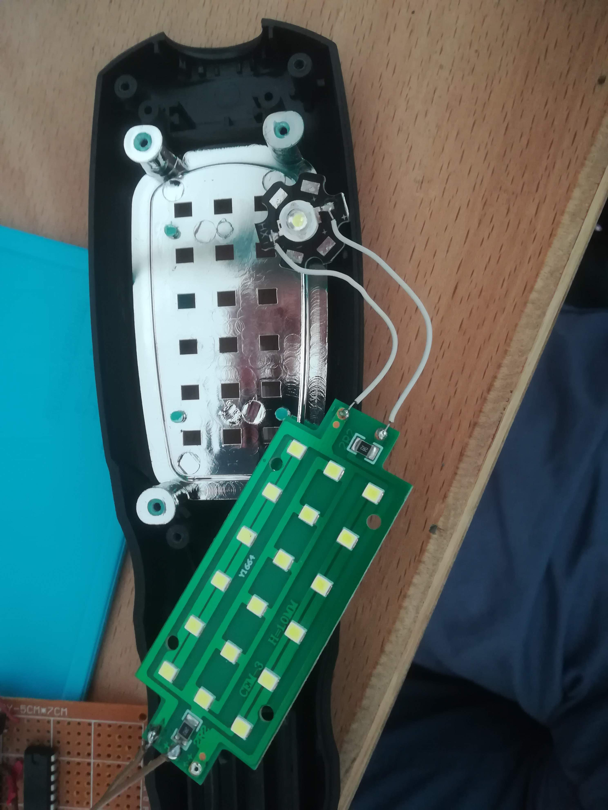

I'm now trying to setup a soft access point following example here:
https://arduino-esp8266.readthedocs.io/en/latest/esp8266wifi/soft-access-point-examples.html

Might be best if my IOT network was independent of our home wifi?

This actually seems to work, which is pretty amazing!

Plan.

Button indoors which connects to wifi.
Server outdoor which connects to wifi

Push button is detected by server. Light flashes.

Broken torch provides light.

Torch runs at 3.5V.

12 LEDs to flash.
Constant draw was 60ma at 3.5V
Could I half this with PWM?

Planning to use ESP8266 ESP01's as transmitter and receiver.

Should test reception in mancave as first test.

Power? How do you power one?
I have a power supply, 3.5V and plenty of 5V?
https://www.youtube.com/watch?v=j21CMZ6Lrfc
Sucks a lot of power.

20 - 250ma!

    x   x   x   x
    
    x   x   x   x

Light to show connection - Can I use onboard LED?

I've had a lot of luck with my programming tonight.
I've had three examples working:

1) Connect to home wifi (FirstConnect.ino)
2) Act as a SoftAP and allow phone to connect to isolated IOT wifi (SoftAP)
3) Serve a webpage toggling GPIO pin with LED on - (WebPage.ino)

I think I want a combination of these - but I need to know more about the SoftAP

I want a transistor to power the LEDs.

The programming board is providing a really handy power supply. Perhaps I should got another?

Read and digest these pages: https://tttapa.github.io/ESP8266/Chap02%20-%20Hardware.html

Before you begin ...
There's a few things you have to look out for when using an ESP8266: The most important thing is that it runs at 3.3V, so if you connect it to a 5V power supply, you'll kill it. Unlike some 3.3V Arduino or Teensy boards, the ESP8266's I/O pins are not 5V tolerant, so if you use a 5V USB-to-Serial converter, or 5V sensors etc. you'll blow it up.
A second thing to keep in mind is that the ESP8266 can only source or sink 12mA per output pin, compared to 20-40mA for most Arduino.

mDNS - lets have DNS on our IOT

I have ordered 10x LT1117 5V to 3.3V regulators.
Capable up to 950ma
These need pairing with two 10uF capacitors.

Next I need a transistor I can use to control 60ma @ 3V...

# 2019_06_11 

Trying new working log by data in README.md

I have one ESP8266 setup as a access point (SoftAP.ino)
I took this outside to the workshop and the range / signal strength seems great.

I thought I had combined webserver / Access point code, but no evidence I did this yet.

Going to do some reading about sleep modes before I decide how to switch my ESP8266.
https://www.losant.com/blog/making-the-esp8266-low-powered-with-deep-sleep
I could possibly battery power the switch if I did this?

WebPageAP combines webserver and access point with mDNS (possibly)
Android doesn't support mDNS at all.

Now I'm writing the switch client, and programming a second board.
https://techtutorialsx.com/2016/07/17/esp8266-http-get-requests/

SwitchClient.ino connects to IOT wireless and uses the url
"http://192.168.0.45/0/on" to switch the light on on the server
doesn't seem to support mDNS lookup?

Still waiting for power.
Going to use USB to get 5V. For server, this needs splitting into two 3.3V supplies.
Build in LED is on Pin 2
Not sure about design of switch yet...

# 2019_06_16 

The 'server' can switch an LED that it is directly powering, but I need to switch the power or ground to the LED matrix.

The LED matrix can pull 60ma (surprised it is this low) - so I am going to power this separately.

Need either and NPN or PNP transistors, depending on if I am switching the ground of the power of the circuit.
What is best for the ESP?

https://electronics.stackexchange.com/questions/211579/npn-transistor-is-always-on?rq=1
NPN transistor switching the ground out of the matrix...
The downside of this is that it means the matrix is always on...

I should be able to use a PNP transistor to switch the power rather than the ground...
https://www.electronics-tutorials.ws/transistor/tran_4.html

Need to be careful, as will be sinking some of the current when turned we pull the PNP base pin to ground.
Voltage divider (43Ko v 620o) ensures current flows through LED.
Resistor is between LED - and ground...

PN2222 - Type - NPN
Collector-Emitter Voltage: 30 V
Collector-Base Voltage: 60 V
Emitter-Base Voltage: 5 V
Collector Current: 0.6 A
Collector Dissipation - 0.625 W
DC Current Gain (hfe) - 100 to 300
Transition Frequency - 300 MHz
Operating and Storage Junction Temperature Range -55 to +150 °C
Package - TO-92

https://www.el-component.com/bipolar-transistors/pn2222

In stock I seem to have

TR3906 https://solarbotics.com/product/tr3906/ https://cdn.solarbotics.com/products/datasheets/2n3906.pdf (100ma)
TR3904 https://cdn.solarbotics.com/products/datasheets/2n3904.pdf (100ma)
TR2907 https://cdn.solarbotics.com/products/datasheets/pn2907a.pdf (500ma)

With flat side up, left to right is EBC

There are two ways to bypass the resistor. One way is to lower the input voltage. If you are able to run your complete circuit with the same voltage as forward voltage of the LED, perfect. No resistor needed.

There is a 3V Vf = LED forward voltage drop in Volts (found in the LED data sheet) for the matrix.

I suspect you are trying to drive the PNP base with a 3.3V logic signal while controlling 5V to the buzzer. That just isn't going to work. To turn the transistor off (non-conducting) you need to raise the voltage on the base to be close to the emitter voltage, or about 5V. You can't do that with a 3.3V logic signal. You make a PNP transistor conduct by lowering the base voltage about 0.7V below the emitter voltage, not by setting the base voltage to 0.7V above ground.

You might be able to add a pull-up resistor from the base itself to 5V to turn the transistor off when the logic output is 3.3V. Select resistor values so that when the 3.3V signal is low the voltage at the base is less than 4.3V. You would also have to select resistor values that limit the current that will flow back into the 3.3V logic output when that output signal is high. This is all just speculation, you haven't provided a data sheet for the device that is driving the base.

https://forum.arduino.cc/index.php?topic=602676.0

https://learn.sparkfun.com/tutorials/transistors/all

So, I have 3.3V pushing into the Collector of the PNP transistor.
If base is connected directly to ground, all that current would rush through.
The voltage drop across that path to base is 0.7V
So (3.3 - 0.7 = 2.4V) V=IR
I want to put just 30ma (0.03A) because according to the data sheet that should give 100ma Ic
The means the transistor has a multiplier of x2.

I'm running 45ma through base, using a resistor 50 ohm resistor

Using a 100ohm resistor, base current is 60ma, Ie is 20ma
Using a 50o, Ie is 50ma

2.4 = 50 * 0.05 (50ma)
At 50ma, DC current gain is 60
2.4 = 100 * 0.025 (25ma)

Current amplification should be between x60 and x100.

# 2019_06_20 

I now have 10 x PN2907A PNP transistors.
https://cdn-shop.adafruit.com/product-files/3598/PN2907A-D.PDF

(IC = -0.1 mAdc, VCE = -10 Vdc) = 75
(IC = -1.0 mAdc, VCE = -10 Vdc) = 100

2.4 = 100 * 0.05 (100ma)

I have 44ma flowing through the base
I have 46ma flowing through the emitter.

Should have 73ma.

22 through base = 50 through emitter
1000ohm 10 through em
300ohm = 25
60 thro 40base em 50 ohm

# 2019_06_23 
Having had no more luck with drawing more than 60ma though LED, switched back to NPN transistor.
2n2222

Trying various resistor combinations on the base. 
I don't understand the resistance of my led grid. 
Depending on how I measure it, it's between 50ohm and 14k ohm

led drawing 60ma 2.96v 
V = I R
2.96 = 0.06 * R = 49ohm

Bypassing transistor, led draws 82ma
This is my target current for full brightness. 
Does the transistor voltage drop play a part here? 

Base @ 40ma 50o resistor - 74.6ma for les
Base @ ? 54o = 74
Base 40 ? 62o = 73
Base @ ? 75o = 72

Base @ 23m 100o - 67ma
Base @ ?m 112o - 63ma
Base @ 17 150o - 52ma
Base @ ? 330o - 64ma

Using a 62ohm resistor made from a 50 and a 12
32ma base current and 78ma led current. 
Resistors getting hot though.
Spread the heat.
67.8o made from 5 x 330o resistors in parallel. 

Connected my circuit to my esp. It is setup to switch gpio2 on command. 

I think I cooked my first esp

introducing a second transistor to switch the first transistor. 
simulated

1k resistor on base, switching the base on q2

1.6

40

# 2019_06_25 

My current regulators have finally arrived!

LM1117
http://www.electronics-lab.com/project/3-3v-voltage-regulator/

http://www.datasheetcafe.com/lm1117-datasheet-national/

https://circuits4you.com/2016/12/14/power-supply-design-esp8266/

https://www.instructables.com/id/LM1117-Linear-Voltage-Regulator/

http://datasheetcafe.databank.netdna-cdn.com/wp-content/uploads/2015/09/LM1117-Pinout.gif
The esp is only rated to deliver 10ma, and I'm needing 32?
What could I do. What if I insert and led between esp and base, decreasing the voltage drop. 
I think I cooked my first esp, it is no longer responding. I may have connected the wrong lead. 

# 2019_06_29 

In a flury of solder the other evening I assembled the 5V -> 3V power source for my torch controlling ESP using the LM1117 with two 10uF capacitors connected to it.

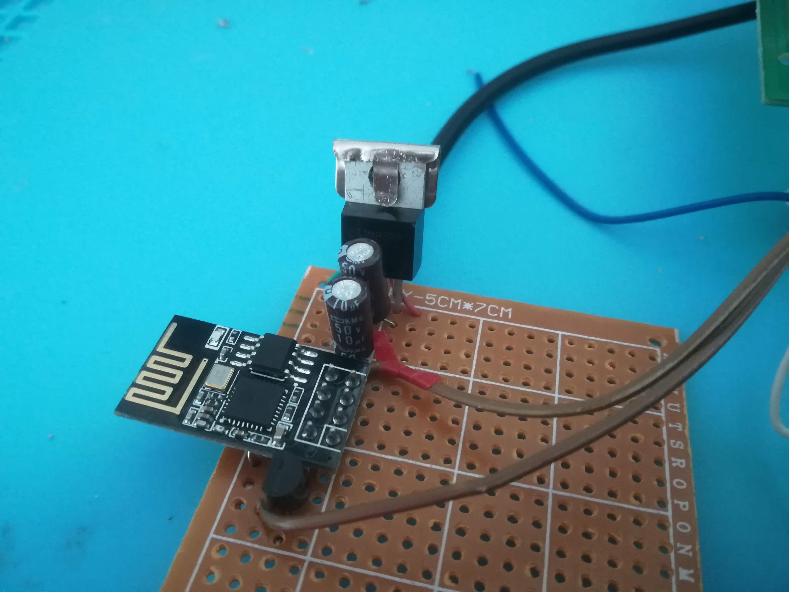

One capacitor connects between the input and gnd legs
The other capacitor connects between the output and ground legs
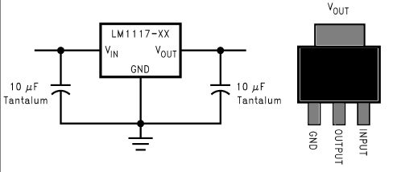
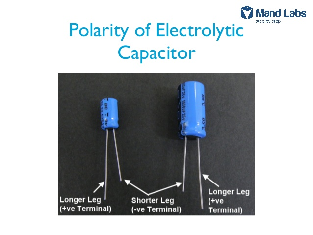
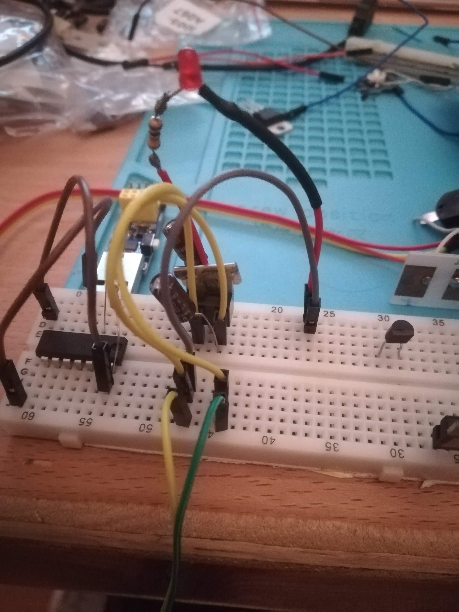

This worked pretty effortlessness on a proto-board, but makes quite a big package.
I also improvised a heat sink with a scrap battery terminal plate.

I wired it up to power the programmed ESP.
I also added a butchered USB lead to provide 5V power (red and blue leads, leaving white and green disconnected other than for strain relief)

I put an NPN transistor in line with the torch ground.
I connected the base of the transistor to ESP IO 0, via a 330ohm resistor.
And here I hit the problem.

In order to boot correctly, the esp GPIO pins 0 and 2 are pulled high by internal resisters.
Meaning, I cannot also pull them low to have the transistor off by default.
The 300ohm resistor does not then put 8ma through the base of the transistor, like it did in my manually switched breadboard circuit...
If i cut the resistor trace so the esp boots, then bridge it with the multimeter, 
when the gpio is off: nothing flows to base
when gpio 0 is on 6.3 ma flows

I can even switch the torch on and off - but it won't boot.
I guess the 300ohm resistor to the base of the transistor is pulling gpio 0 to base on boot.

I ordered a mos-fet, but its n-channel, so I think that will have the same problem ( although it would pull few ma to ground)

I have some hex invertor chips, but they are huge!

74HC04T
https://assets.nexperia.com/documents/data-sheet/74HC_HCT04.pdf

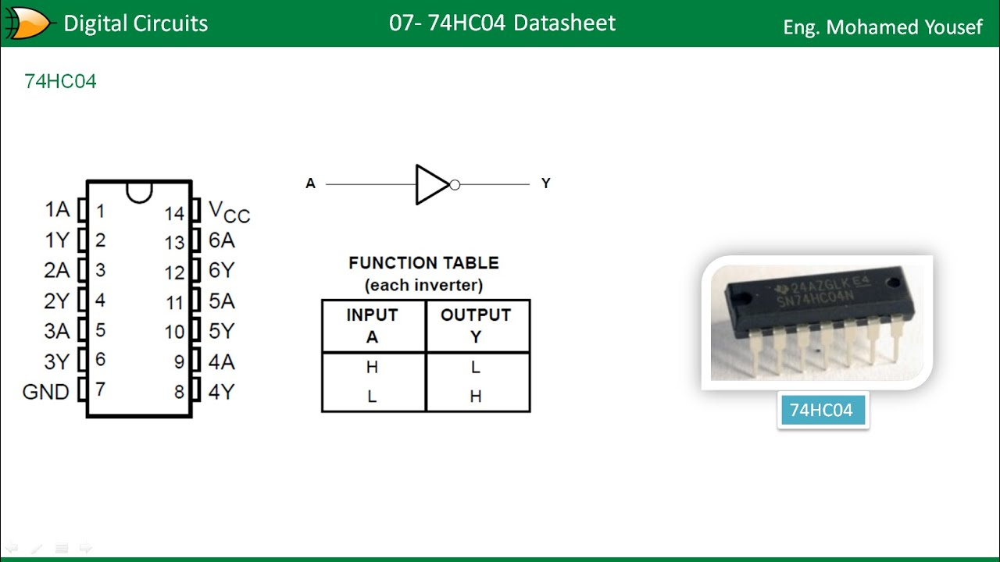
.jpg

Wired up the ground and 3.3V on the invertor.

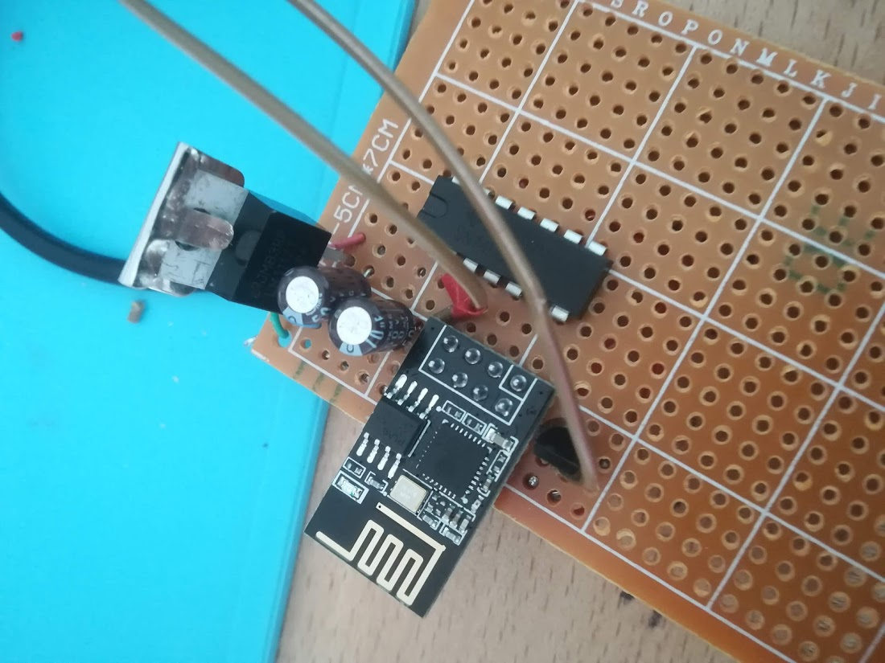

Using pins 9 (input 4A) and 8 (output 4Y)

Connected the GPIO 0 resistor to the input
Connected the transistor base to the output.

It works just fine.

The layout is a large mess, and I need to remember to leave the pins free for programming.
Maybe even use a header socket?

When the mosfet arrives next week, I might build a circuit on breadboard so I can understand how to drive the mosfet. Then I will chose my final design and build a new circuit.

# 2019_07_03 

My mosfets arrived today.

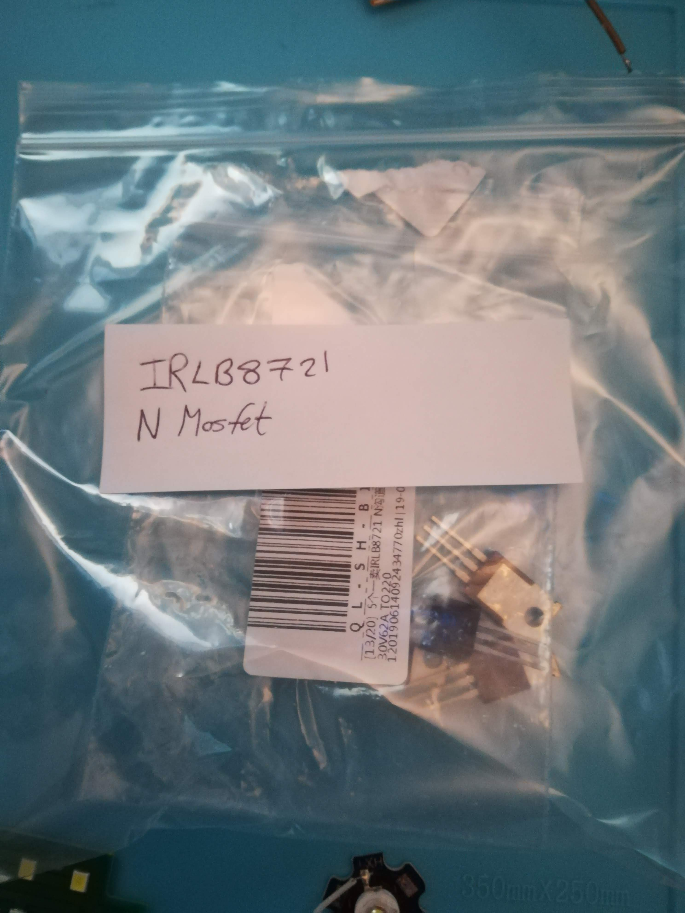
https://www.adafruit.com/product/355
https://cdn-shop.adafruit.com/datasheets/irlb8721pbf.pdf

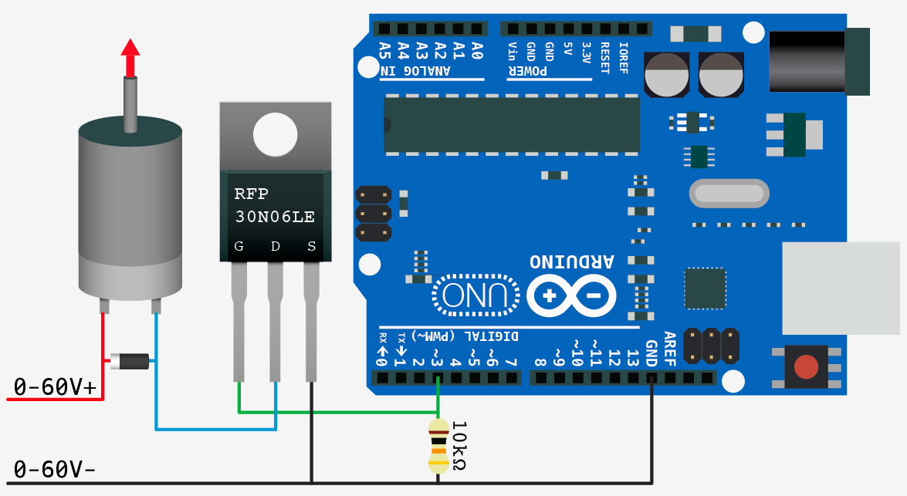

I weird up my torch to a simple breadboard circuit.

3.3V power to torch.

Looking at the mosfet, the legs are G D S

S is connected to the negative terminal of the torch.
D is connected to ground of the power supply.
To turn the mosfet on, we generate a PD between G and S.
S is at ground.
A 10k resistor pulls G to ground - no PD.
If we connect 3.3V to G, then the mosfet turns on.

But not by much....

I was only getting 6ma through the torch (not 60+ma)
The resistance between Source and Drain (with should be in the mili-ohms) was about 500 ohms.

Looking at the graph on the data sheet, this is not too much of a surprise.
I used the 5V on the power supply to generate a 5V PD between G and S - this caused the MOSFET to turn on fully. Boo!

So, looks like it's back to the not gate and NPN transistor...

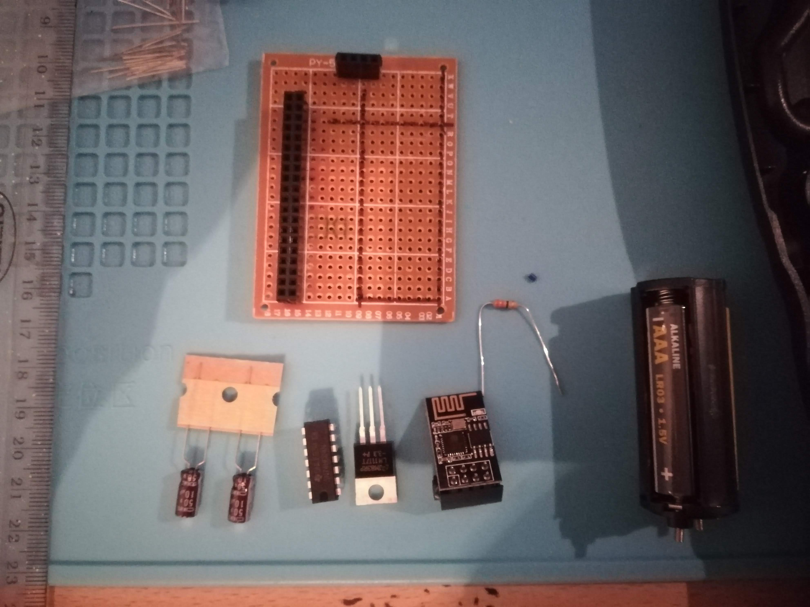

Ok, so I want the esp to be removable so I can easily program it.
I also need to fit these components, including the big hex invertor onto that small rectangle marked on the perf board.
The batteries on the right are the unit that I'm replacing in the torch, so that's the volume I have to play with.

Technically I could cut some more space inside the torch, but this should be doable.

# 2019_07_05 

I assembled some of this yesterday, but I was getting tired and making mistakes so I stopped.

Fixed the mistakes today, hunted down a bad joint, and the final circuit was ready.

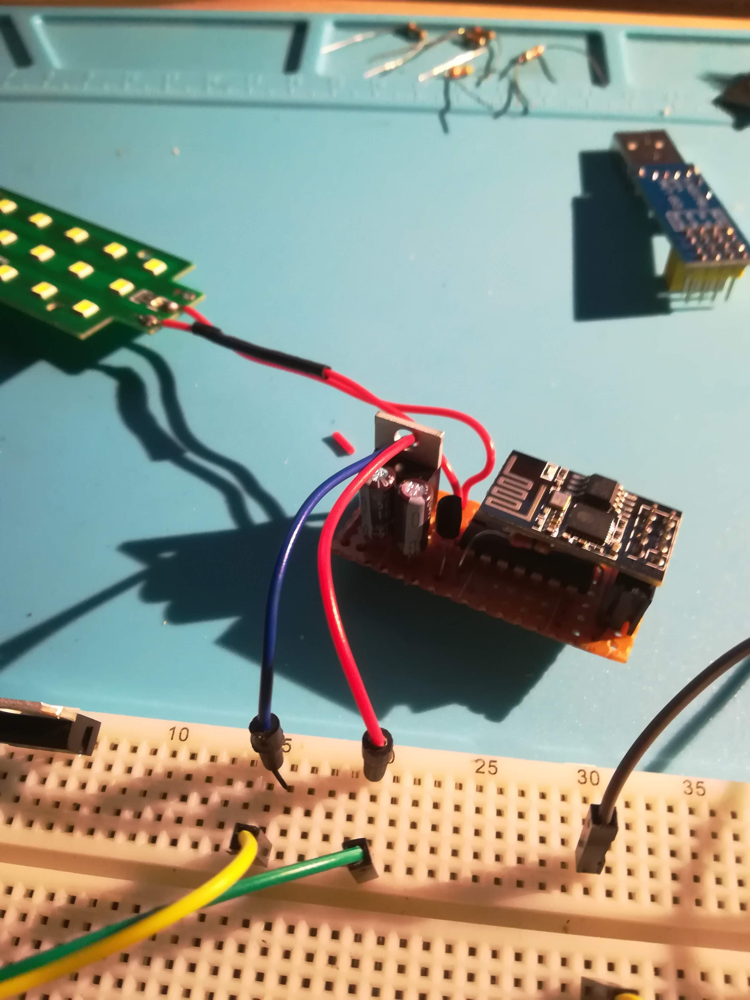

I'm still powering it off a breadboard at 5V, because I'm hoping to do something clever with the bottom of the torch housing, so don't want to finalise the USB lead coming in.

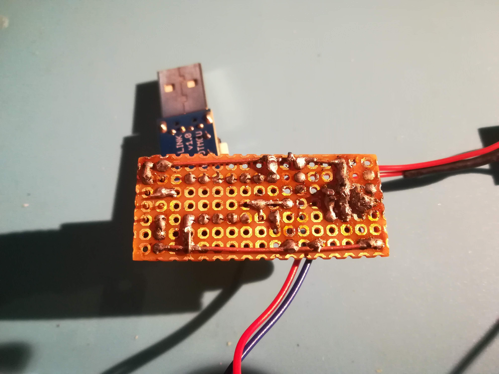

I put in long brass wires along each side to act as 3.3V and GND bus, however these made soldering hard, as they took a LOT of heating.
I should have bent the regulator legs to give me more space to work.

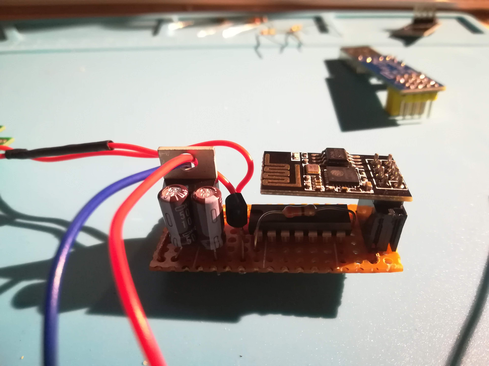

I worked some more on the code, to add flash functionality (and to swap the torch to off (output low) by default)

See: WebPageAP.ino

I also fixed the IP address at 192.168.0.45/flash

Then I could do a first fit:

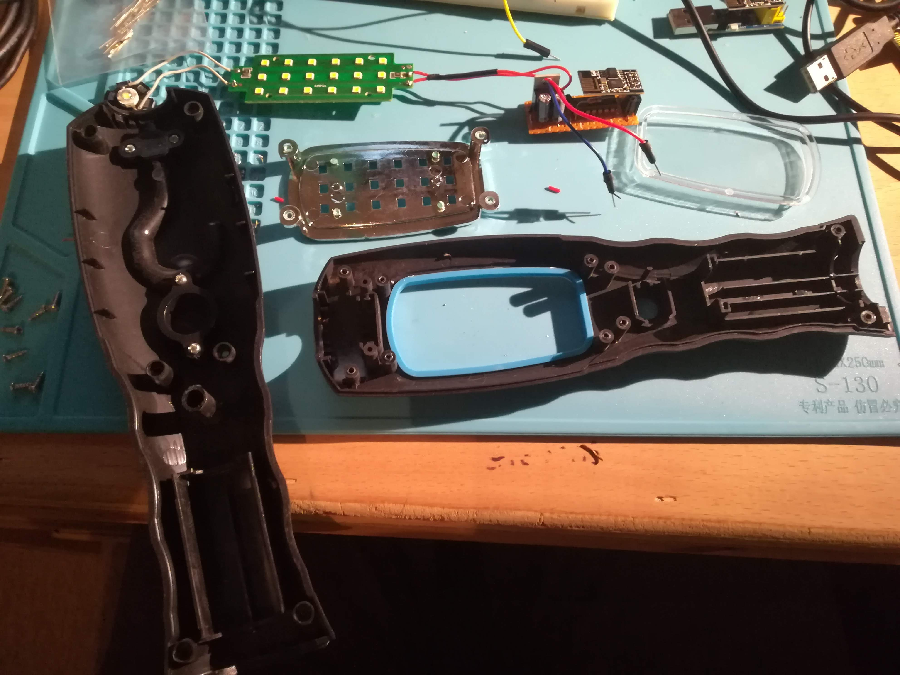

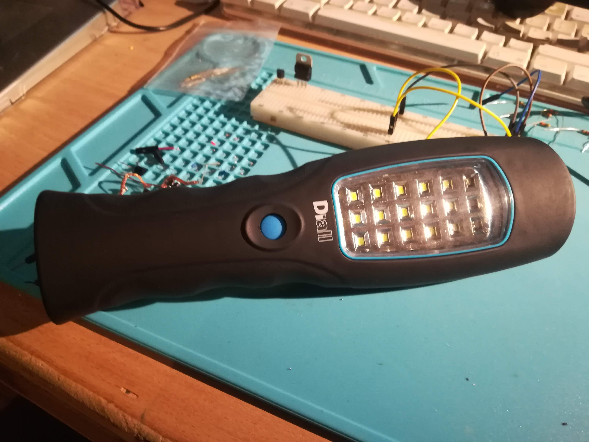

It all fits. Just the USB power now, then I can test reception and start work on the switch.

# 2019_07_24

The reason my Daughter's torch was sacrificed was because she lost the bottom cover.
In order for it to work well as a signal light, I had to fill that hole in the bottom.

I carefully measured the opening and modelled a replacement part.

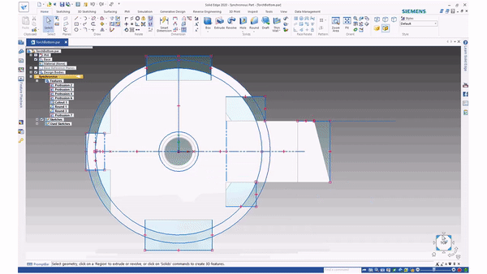

Rendering:

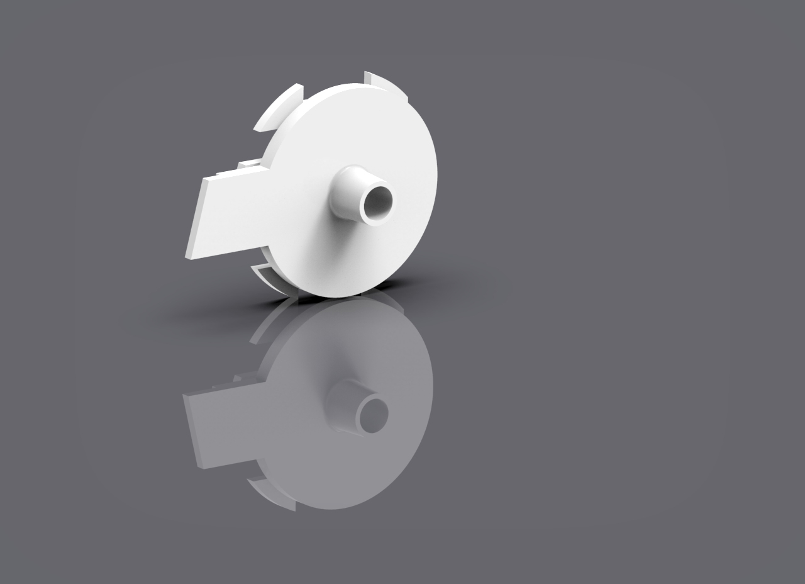

My friend kindly 3d printed me a part to replace the missing battery cover. Yes, I know, I'm lucky to have friends like that.

This allowed me to finish off the wiring.

# 2019_07_26 

I made a sculpture of a poppy in brass coated wire. It can act as a capacitor of sorts.

I used the amazing library https://github.com/PaulStoffregen/CapacitiveSensor

and had a version working on arduino nano in no time.
(1M resistor used)

I wondered how hard it was going to be getting it to work on the esp - but with a tip from here:
https://github.com/PaulStoffregen/CapacitiveSensor/issues/18 to use a 300k resistor, I had it working pretty quickly.

I got a bit lucky, with no wiring or pin number bugs as these would have been a real hassle to track down.

Now I need to integrate the sensor code with the wifi code.

I can start work on the wood working for the switch.

Notes:

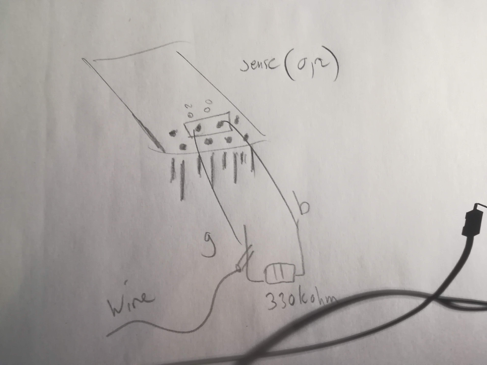
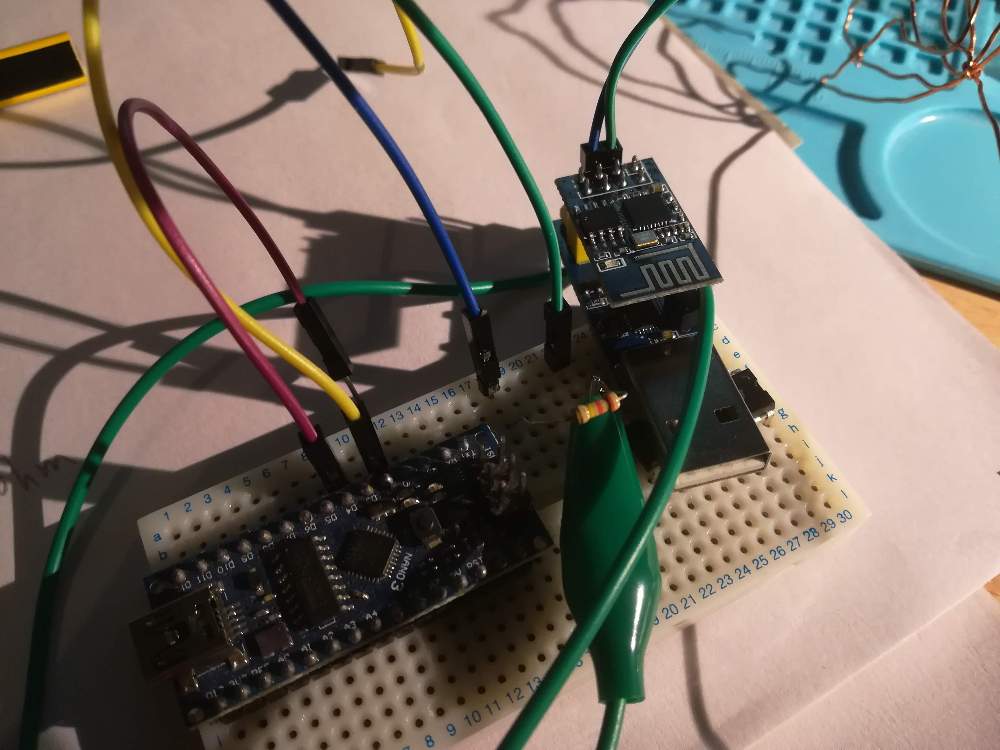

[Youtube build video](https://youtu.be/MuTEnnFnPo8)

# 2019_07_27 

My Wife has enabled me to have a super-productive Saturday. And by productive, I really mean not doing anything very useful, but having lots of time to work on this project.

I soldered up the power supply (5V to 3V) and 2x4 socket headers onto some protoboard.
I butchered another USB lead for powering it.

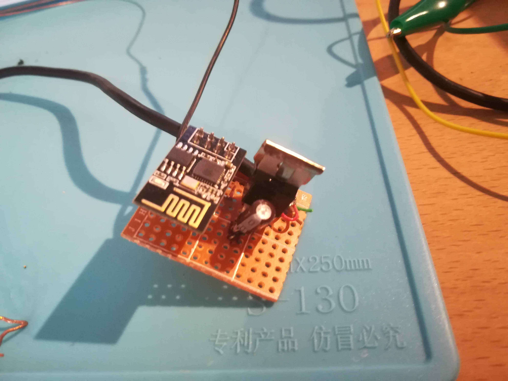

I got some hours in the mancave too. I trimmmed the proto-board down, and picked a bit of oak offcut for the base.

I hogged out much of the hunk of oak with a tea-light sized forstner bit (three overlapping circles)

I sanded the block down and rounded to the edges to deal with some rough spots.

I applied a coat of danish oil, cut a notch for the power cable, and used the smallest drill bit I have to put a hole top, center for the poppy wire.

I came back to the software and modified espSensor.ide to connect to the torch Wifi, and to get the flash URL when the capacitive senor is triggered.

# 2019_07_28 

I've just had the torch apart on my solder bence again.
After running for a few hours it stopped working.

I'd built in a flash-on-boot, so that I could at least tell if it was getting as far as booting - and it wasn't even doing that.

I traces the fault to those tricky USB wires, so I stripped them back and did a better job connecting them into the board.

Most of today I've been working on the poppy switch.
I'm going to make the youtube video for that now.

Much simpler circuit, so not as many days tinkering.
It through me a curve mid assembly though, so I wouldn't be suprised if I have to revist that too.